# Core Schemas

<h2>flexible metadata for GraphQL schemas</h2>

```raw html
<table class=spec-data>
  <tr><td>Status</td><td>Release</td>
  <tr><td>Version</td><td>0.1</td>
</table>
<link rel=stylesheet href=https://specs.apollo.dev/apollo-light.css>
<script type=module async defer src=https://specs.apollo.dev/inject-logo.js></script>
```

[GraphQL](https://spec.graphql.org/) provides directives as a means of attaching user-defined metadata to a GraphQL document. Directives are highly flexible, and can be used to suggest behavior and define features of a graph which are not otherwise evident in the schema.

Alas, *GraphQL does not provide a mechanism to globally identify or version directives*. Given a particular directive—e.g. `@join`—processors are expected to know how to interpret the directive based only on its name, definition within the document, and additional configuration from outside the document. This means that programs interpreting these directives have two options:

  1. rely on a hardcoded interpretation for directives with certain signatures, or
  2. accept additional configuration about how to interpret directives in the schema.

The first solution is fragile, particularly as GraphQL has no built-in namespacing mechanisms, so the possibility of name collisions always looms.

The second is unfortunate: GraphQL schemas are generally intended to be self-describing, and requiring additional configuration subtly undermines this guarantee: given just a schema, programs do not necessarily know how to interpret it, and certainly not how to serve it. It also creates the possibility for the schema and configuration to fall out of sync, leading to issues which can manifest late in a deployment pipeline.

Introducing **core schemas**.

<div class=hbox>
  <a class=core>
    <div class=ring></div>
    <div class=nucleus>core schema</div>
  </a>
</div>

A basic core schema:

:::[example](basic.graphql) -- A basic core schema

**Core schemas** provide a concise mechanism for schema documents to specify the metadata they provide. Metadata is grouped into **features**, which typically define directives and associated types (e.g. scalars and inputs which serve as directive inputs). Additionally, core schemas provide:
  - [**Flexible namespacing rules.**](#sec-Prefixing) It is always possible to represent any GraphQL schema within a core schema document. Additionally, documents can [choose the names](#@core/as) they use for the features they reference, guaranteeing that namespace collisions can always be resolved.
  - [**Versioning.**](#sec-Versioning) Feature specifications follow [semver-like semantic versioning principles](#sec-Versioning), which helps schema processors determine if they are able to correctly interpret a document's metadata.

**Core schemas are not a new language.** All core schema documents are valid GraphQL schema documents. However, this specification introduces new requirements, so not all valid GraphQL schemas are valid core schemas.

The broad intention behind core schemas is to provide a *single document* which provides all the necessary configuration for programs that process and serve the schema to GraphQL clients, primarily by following directives in order to determine how to resolve queries made against that schema.

# Parts of a Core Schema

When talking about a core schema, we can broadly break it into two pieces:
- an **API** consisting of schema elements (objects, interfaces, enums, directives, etc.) which SHOULD be served to clients, and
- **machinery** containing document metadata. This typically consists of directives and associated input types (such as enums and input objects), but may include any schema element. Machinery MUST NOT be served to clients. Specifically, machinery MUST NOT be included in introspection responses or used to validate or execute queries.

This reflects how core schemas are used: a core schema contains a GraphQL interface (the *API*) along with metadata about how to implement that interface (the *machinery*). Exposing the machinery to clients is unnecessary, and may in some cases constitute a security issue (for example, the machinery for a public-facing graph router will likely reference internal services, possibly exposing network internals which should not be visible to the general public).

A key feature of core schemas is that it is always possible to derive a core schema's API without any knowledge of the features used by the document (with the exception of the `core` feature itself). Specifically, named elements are not included in the API schema if they are named `something__likeThis` or are a directive named `@something`, and `something` is the prefix of a feature declared with {@core}.

A formal description is provided by the [IsInAPI](#sec-Is-In-API-) algorithm.

# Actors

```mermaid diagram -- Actors who may be interested in the core schemas
graph TB
  classDef bg fill:none,color:#22262E;
  author("👩🏽‍💻 🤖  &nbsp;Author"):::bg-->schema(["☉ Core Schema"]):::bg
  schema-->proc1("🤖 &nbsp;Processor"):::bg
  proc1-->output1(["☉ Core Schema[0]"]):::bg
  output1-->proc2("🤖 &nbsp;Processor"):::bg
  proc2-->output2(["☉ Core Schema[1]"]):::bg
  output2-->etc("..."):::bg
  etc-->final(["☉ Core Schema [final]"]):::bg
  final-->core("🤖 Data Core"):::bg
  schema-->reader("👩🏽‍💻  Reader"):::bg
  output1-->reader
  output2-->reader
  final-->reader
```



- **Authors (either human or machine)** write an initial core schema as specified in this document, including versioned {@core} requests for all directives they use
- **Machine processors** can process core schemas and output new core schemas. The versioning of directives and associated schema elements provided by the {@core} allows processors to operate on directives they understand and pass through directives they do not.
- **Human readers** can examine the core schema at various stages of processing. At any stage, they can examine the {@core} directives and follow URLs to the specification, receiving an explanation of the requirements of the specification and what new directives, types, and other schema objects are available within the document.
- **Data cores** can then pick up the processed core schema and provide some data-layer service with it. Typically this means serving the schema's API as a GraphQL endpoint, using metadata defined by machinery to inform how it processes operations it receives. However, data cores may perform other tasks described in the core schema, such as routing to backend services, caching commonly-accessed fields and queries, and so on. The term "data core" is intended to capture this multiplicity of possible activities.

# Basic Requirements

Core schemas:
  1. MUST be valid GraphQL schema documents,
  2. MUST contain exactly one `SchemaDefinition`, and
  3. MUST use the {@core} directive on their schema definition to declare any features they reference by using {@core} to reference a [well-formed feature URL](#@core/feature).

The first {@core} directive on the schema MUST reference the core spec itself, i.e. this document.

:::[example](basic.graphql) -- Basic core schema using {@core} and `@example`

## Unspecified directives are passed through by default

Existing schemas likely contain definitions for directives which are not versioned, have no specification document, and are intended mainly to be passed through. This is the default behavior for core schema processors:

```graphql example -- Unspecified directives are passed through
schema
  @core(feature: "https://specs.apollo.dev/core/v0.1")
{
  query: Query
}

type SomeType {
  field: Int @another
}

# `@another` is unspecified. Core processors will not extract metadata from
# it, but its definition and all usages within the schema will be exposed
# in the API.
directive @another on FIELD_DEFINITION

directive @core(feature: String!, as: String) repeatable on SCHEMA
```

## Renaming core itself

It is possible to rename the core feature itself with the same [`as:`](#@core/as) mechanism used for all features:

```graphql example -- Renaming {@core} to {@coreSchema}
schema
  @coreSchema(feature: "https://specs.apollo.dev/core/v0.1", as: "coreSchema")
  @coreSchema(feature: "https://example.com/example/v1.0")
{
  query: Query
}

type SomeType {
  field: Int @example
}

directive @coreSchema(feature: String!, as: String)
  repeatable on SCHEMA
directive @example on FIELD_DEFINITION
```

# Directive Definitions

All core schemas use the [{@core}](#@core) directive to declare their use of the `core` feature itself as well as any other core features they use.

In order to use these directives in your schema, GraphQL requires you to include their definitions in your schema.

Processors MUST validate that you have defined the directives with the same arguments, locations, and `repeatable` flag as given below. Specifically, the [bootstrapping](#sec-Bootstrapping) algorithm validates that the `@core` directive has a definition matching the definition given below. (The bootstrapping algorithm does not require processors to validate other aspects of the directive declaration such as description strings or argument ordering. The main purpose of this validation is to ensure that directive arguments have the type and default values expected by the specification.)

The following declares the directive defined by this specification. You SHOULD define the directives in your core schema by including the following text in your schema document.

```graphql
directive @core(feature: String!, as: String) repeatable on SCHEMA
```

When writing a specification for your own core feature, you SHOULD include a section like this one with sample definitions to copy into schemas, and you SHOULD require processors to validate that directive definitions in documents match your sample definitions.

# Directives

##! @core

Declare a core feature present in this schema.

:::[definition](./core-v0.1.graphql#@core)

Documents MUST include a definition for the {@core} directive which includes all of the arguments defined above with the same types and default values.

###! feature: String!

A feature URL specifying the directive and associated schema elements. When viewed, the URL SHOULD provide the content of the appropriate version of the specification in some human-readable form. In short, a human reader should be able to click the link and go to the docs for the version in use. There are specific requirements on the format of the URL, but it is not required that the *content* be machine-readable in any particular way.

Feature URLs contain information about the spec's [prefix](#sec-Prefixing) and [version](#sec-Versioning).

Feature URLs serve two main purposes:
  - Directing human readers to documentation about the feature
  - Providing tools with information about the specs in use, along with enough information to select and invoke an implementation

Feature URLs SHOULD be [RFC 3986 URLs](https://tools.ietf.org/html/rfc3986). When viewed, the URL SHOULD provide the specification of the selected version of the feature in some human-readable form; a human reader should be able to click the link and go to the correct version of the docs.

Although they are not prohibited from doing so, it's assumed that processors will not load the content of feature URLs. Published specifications are not required to be machine-readable, and [this spec](.) places no requirements on the structure or syntax of the content to be found there.

There are, however, requirements on the structure of the URL itself:

```html diagram -- Basic anatomy of a feature URL
<code class=anatomy>
  <span class=pink style='--depth: 2'>https://spec.example.com/a/b/c/<span>exampleFeature<aside>name</aside></span><aside>identity</aside></span>/<span style='--depth: 2' class=green>v1.0<aside>version</aside></span>
</code>
```

The final two segments of the URL's [path](https://tools.ietf.org/html/rfc3986#section-3.3) MUST contain the feature's name and a [version tag](#sec-Versioning). The content of the URL up to and including the name—but excluding the `/` after the name and the version tag—is the feature's *identity*. Trailing slashes at the end of the URL (ie, after the version tag) should be ignored. For the above example,
<dl>
  <dt>`identity: "https://spec.example.com/a/b/c/exampleFeature"`</dt>
  <dd>A global identifier for the feature. Processors can treat this as an opaque string identifying the feature (but not the version of the feature) for purposes of selecting an appropriate implementation. The identity never has a trailing `/`.</dd>
  <dt>`name: "exampleFeature"`</dt>
  <dd>The feature's name, for purposes of [prefixing](#sec-Prefixing) schema elements it defines.</dd>
  <dt>`version: "v1.0"`</dt>
  <dd>The tag for the [version](#sec-Versioning) of the feature used to author the document. Processors MUST select an implementation of the feature which can [satisfy](#sec-Satisfaction) the specified version.</dd>
</dl>

The version tag MUST be a valid {VersionTag}. The name MUST be a valid [GraphQL name](https://spec.graphql.org/draft/#Name) which does not include the namespace separator ({"__"}).

#### Ignore meaningless URL components

When extracting the URL's `name` and `version`, processors MUST ignore any url components which are not assigned a meaning. This spec assigns meaning to the final two segments of the [path](https://tools.ietf.org/html/rfc3986#section-3.3). Other URL components—particularly query strings and fragments, if present—MUST be ignored for the purposes of extracting the `name` and `version`.

```html diagram -- Ignoring meaningless parts of a URL
<code class=anatomy>
  <span class=pink style='--depth: 2'>https://example.com/<span>exampleSpec<aside>name</aside></span><aside>identity</aside></span>/<span style='--depth: 2' class=green>v1.0<aside>version</aside></span><span class=grey>/?key=val&k2=v2#frag<aside>ignored</aside></span>
</code>
```

#### Why is versioning in the URL, not a directive argument?

The version is in the URL because when a human reader visits the URL, we would like them to be taken to the documentation for the *version of the feature used by this document*. Many text editors will turn URLs into hyperlinks, and it's highly desirable that clicking the link takes the user to the correct version of the docs. Putting the version information in a separate argument to the {@core} directive would prevent this.

###! as: String

Change the [names](#sec-Prefixing) of directives and schema elements from this specification. The specified string MUST be a valid [GraphQL name](https://spec.graphql.org/draft/#Name) and MUST NOT contain the namespace separator (two underscores, {"__"}) or end with an underscore.

When [`as:`](#@core/as) is provided, processors looking for [prefixed schema elements](#sec-Elements-which-must-be-prefixed) MUST look for elements whose names are the specified name with the prefix replaced with the name provided to the `as:` argument.

```graphql example -- Using {@core}(feature:, as:) to use a feature with a custom name
schema
  @core(feature: "https://specs.apollo.dev/core/v0.1")
  @core(feature: "https://spec.example.com/example/v1.0", as: "eg")
{
  query: Query
}

type User {
  # Specifying `as: "eg"` transforms @example into @eg
  name: String @eg(data: ITEM)
}

# Additional specified schema elements must have their prefixes set
# to the new name.
#
# The spec at https://spec.example.com/example/v1.0 calls this enum
# `example__Data`, but because of the `as:` argument above, processors
# will use this `eg__Data` enum instead.
enum eg__Data {
  ITEM
}

# Name transformation must also be applied to definitions pulled in from
# specifications.
directive @eg(data: eg__Data) on FIELD_DEFINITION

directive @core(feature: String!, as: String) repeatable on SCHEMA
```

# Prefixing

With the exception of a single root directive, core feature specifications MUST prefix all schema elements they introduce. The prefix:
  1. MUST match the name of the feature as derived from the feature's specification URL,
  2. MUST be a valid [GraphQL name](https://spec.graphql.org/draft/#Name), and
  3. MUST NOT contain the core namespace separator, which is two underscores ({"__"}), and
  4. MUST NOT end with an underscore (which would create ambiguity between whether {"x___y"} is prefix `x_` for element `y` or prefix `x` for element `_y`).

Prefixed names consist of the name of the feature, followed by two underscores, followed by the name of the element, which can be any valid [GraphQL name](https://spec.graphql.org/draft/#Name). For instance, the `core` specification (which you are currently reading) introduces an element named [{@core}](#@core), and the `join` specification introduces an element named {@join__field} (among others).

Note that both parts must be valid GraphQL names, and GraphQL names cannot start with digits, so core feature specifications cannot introduce names like `@feature__24hours`.

A feature's *root directive* is an exception to the prefixing requirements. Feature specifications MAY introduce a single directive which carries only the name of the feature, with no prefix required. For example, the `core` specification introduces a {@core} directive. This directive has the same name as the feature ("`core`"), and so requires no prefix.

```graphql example -- Using the @core directive without changing the prefix
schema
 @core(feature: "https://specs.apollo.dev/core/v0.1")
 @core(feature: "https://spec.example.com/example/v1.0") {
  query: Query
}

type User {
  name: String @example(data: ITEM)
}

# An enum used to provide structured data to the example spec.
# It is prefixed with the name of the spec.
enum example__Data {
  ITEM
}

directive @example(data: example__Data) on FIELD_DEFINITION

directive @core(feature: String!, as: String) repeatable on SCHEMA
```

The prefix MUST NOT be elided within documentation; definitions of schema elements provided within the spec MUST include the feature's name as a prefix.

## Elements which must be prefixed

Feature specs MUST prefix the following schema elements:
  - the names of any object types, interfaces, unions, enums, or input object types defined by the feature
  - the names of any directives introduced in the spec, with the exception of the *root directive*, which must have the same name as the feature

:::[example](prefixing.graphql) -- Prefixing

# Versioning

VersionTag : "v" Version

Version : Major "." Minor

Major : NumericIdentifier

Minor : NumericIdentifier

NumericIdentifier : "0"
  | PositiveDigit Digit*

Digit : "0" | PositiveDigit

PositiveDigit : "1" | "2" | "3" | "4" | "5" | "6" | "7" | "8" | "9"

Specs are versioned with a **subset** of a [Semantic Version Number](https://semver.org/spec/v2.0.0.html) containing only the major and minor parts. Thus, specifications SHOULD provide a version of the form `v`{Major}`.`{Minor}, where both integers >= 0.

```text example -- Valid version tags
v2.2
v1.0
v1.1
v0.1
```

As specified by semver, spec authors SHOULD increment the:

{++

- MAJOR version when you make incompatible API changes,
- MINOR version when you add functionality in a backwards compatible manner

++}

Patch and pre-release qualifiers are judged to be not particularly meaningful in the context of core features, which are (by definition) interfaces rather than implementations. The patch component of a semver denotes a bug fix which is backwards compatible—that is, a change to the implementation which does not affect the interface. Patch-level changes in the version of a spec denote wording clarifications which do not require implementation changes. As such, it is not important to track them for the purposes of version resolution.

As with [semver](https://semver.org/spec/v2.0.0.html), the `0.x` version series is special: there is no expectation of compatibility between versions `0.x` and `0.y`. For example, a processor must not activate implementation `0.4` to satisfy a requested version of `0.2`.

## Satisfaction

Given a version {requested} by a document and an {available} version of an implementation, the following algorithm will determine if the {available} version can satisfy the {requested} version:

Satisfies(requested, available) :
  1. If {requested}.{Major} ≠ {available}.{Major}, return {false}
  2. If {requested}.{Major} = 0, return {requested}.{Minor} = {available}.{Minor}
  3. Return {requested}.{Minor} <= {available}.{Minor}

## Referencing versions and activating implementations

Schema documents MUST reference a feature version which supports all the schema elements and behaviors required by the document. As a practical matter, authors will generally prefer to reference a version they have reason to believe is supported by the most processors; depending on context, this might be an old stable version with a low major version, or a new less-deprecated version with a large major version.

If a processor chooses to activate support for a feature, the processor MUST activate an implementation which can [satisfy](#sec-Satisfaction) the version required by the document.


# Processing Schemas

```mermaid diagram
graph LR
  schema(["📄  Input Schema"]):::file-->proc("🤖 &nbsp;Processor")
  proc-->output(["📄  Output Schema"]):::file
  classDef file fill:none,color:#22262E;
  style proc fill:none,stroke:fuchsia,color:fuchsia;
```



A common use case is that of a processor which consumes a valid input schema and generates an output schema.

The general guidance for processor behavior is: don't react to what you don't understand.

Specifically, processors:
  - SHOULD pass through {@core} directives which reference unknown feature URLs
  - SHOULD pass through prefixed directives, types, and other schema elements
  - SHOULD pass through directives which are not [associated with](#AssignFeatures) a {@core} feature

Processors MAY accept configuration which overrides these default behaviors.

Additionally, processors which prepare the schema for final public consumption MAY choose to eliminate all unknown directives and prefixed types in order to hide schema implementation details within the published schema. This will impair the operation of tooling which relies on these directives—such tools will not be able to run on the output schema, so the benefits and costs of this kind of information hiding should be weighed carefully on a case-by-case basis.

# Validations &amp; Algorithms

This section lays out algorithms for processing core schemas.

Algorithms described in this section may produce *validation failures* if a document does not conform to the requirements core schema document. Validation failures SHOULD halt processing. Some consumers, such as authoring tools, MAY attempt to continue processing in the presence of validation failures, but their behavior in such cases is unspecified.

## Bootstrapping

Determine the name of the core specification within the document.

It is possible to [rename the core feature](#sec-Renaming-core-itself) within a document. This process determines the actual name for the core feature if one is present.

- **Fails** the *Has Schema* validation if there are no SchemaDefinitions in the document
- **Fails** the *Has Core Feature* validation if the `core` feature itself is not referenced with a {@core} directive within the document
- **Fails** the *Bootstrap Core Feature Listed First* validation if the reference to the `core` feature is not the first {@core} directive on the document's SchemaDefinition
- **Fails** the *Core Directive Incorrect Definition* validation if the {@core} directive definition does not *match* the directive as defined by this specification.

For the purposes of this algorithm, a directive's definition in a schema *matches* a definition provided in this specification if:
- Its arguments have the specified names, types, and default values (or lack thereof)
- It is defined as `repeatable` if and only if the specification's definition defines it as `repeatable`
- The set of locations it belongs to is the same set of locations in the specification's definition.

The following aspects may differ between the definition in the schema and the definition in the specification without preventing the definitions from *matching*:
- The name of the directive (due to [prefixing](#sec-Prefixing))
- The order of arguments
- The order of locations
- The directive's description string
- Argument description strings
- Directives applied to argument definitions

Bootstrap(document) :
1. Let {schema} be the only SchemaDefinition in {document}. (Note that legal GraphQL documents [must include at most one SchemaDefinition](http://spec.graphql.org/draft/#sec-Root-Operation-Types).)
  1. ...if no SchemaDefinitions are present in {document}, the ***Has Schema* validation fails**.
1. For each directive {d} on {schema},
  1. If {d} has a [`feature:`](#@core/feature) argument which [parses as a feature URL](#@core/feature), *and* whose identity is {"https://specs.apollo.dev/core/"} *and* whose version is {"v0.1"}, *and either* {d} has an [`as:`](#@core/as) argument whose value is equal to {d}'s name *or* {d} does not have an [`as:`](#@core/as) argument and {d}'s name is `core`:
    - If any directive on {schema} listed before {d} has the same name as {d}, the ***Bootstrap Core Feature Listed First* validation fails**.
    - If the definition of the directive {d} does not *match* the [definition of {@core} in this specification](#@core), the ***Core Directive Incorrect Definition* validation fails**.
    - Otherwise, **Return** {d}'s name.
- If no matching directive was found, the ***Has Core Feature* validation fails**.

## Feature Collection

Collect a map of ({featureName}: `String`) -> `Directive`, where `Directive` is a {@core} Directive which introduces the feature named {featureName} into the document.

- **Fails** the *Name Uniqueness* validation if feature names are not unique within the document.
- **Fails** *Invalid Feature URL* validation for any invalid feature URLs.

CollectFeatures(document) :
  - Let {coreName} be the name of the core feature found via {Bootstrap(document)}
  - Let {features} be a map of {featureName}: `String` -> `Directive`, initially empty.
  - For each directive {d} named {coreName} on the SchemaDefinition within {document},
    - Let {specifiedFeatureName} and {version} be the result of parsing {d}'s `feature:` argument according to the [specified rules for feature URLs](#@core/feature)
    - If the `feature:` is not present or fails to parse:
      - The ***Invalid Feature URL* validation fails** for {d},
    - Let {featureName} be the {d}'s [`as:`](#@core/as) argument or, if the argument is not present, {specifiedFeatureName}
    - If {featureName} exists within {features}, the ***Name Uniqueness* validation fails**.
    - Insert {featureName} => {d} into {features}
  - **Return** {features}


Prefixes, whether implicit or explicit, must be unique within a document. Valid:

:::[example](prefixing.graphql#schema[0]) -- Unique prefixes

It is also valid to reference multiple versions of the same spec under different prefixes:

:::[example](prefix-uniqueness.graphql#schema[0]) -- Explicit prefixes allow multiple versions of the same spec to coexist within a Document

Without the explicit [`as:`](#@core/as), the above would be invalid:

:::[counter-example](prefix-uniqueness.graphql#schema[1]) -- Non-unique prefixes with multiple versions of the same spec

Different specs with the same prefix are also invalid:

:::[counter-example](prefix-uniqueness.graphql#schema[2]) -- Different specs with non-unique prefixes

## Assign Features

Create a map of {element}: *Any Named Element* -> {feature}: `Directive` | {null}, associating every named schema element within the document with a feature directive, or {null} if it is not associated with a feature.

AssignFeatures(document) :
  - Let {features} be the result of collecting features via {CollectFeatures(document)}
  - Let {assignments} be a map of ({element}: *Any Named Element*) -> {feature}: `Directive` | {null}, initally empty
  - For each named schema element {e} within the {document}
    - Let {name} be the name of the {e}
    - If {e} is a Directive and {name} is a key within {features},
      - Insert {e} => {features}`[`{name}`]` into {assignments}
      - **Continue** to next {e}
    - If {name} begins with {"__"},
      - Insert {e} => {null} into {assignments}
      - **Continue** to next {e}
    - If {name} contains the substring {"__"},
      - Partition {name} into `[`{prefix}, {base}`]` at the first {"__"} (that is, find the shortest {prefix} and longest {base} such that {name} = {prefix} + {"__"} + {base})
      - If {prefix} exists within {features}, insert {e} => {features}`[`{prefix}`]` into {assignments}
        - Else, insert {e} => {null} into {assignments}
      - **Continue** to next {e}
    - Insert {e} => {null} into {assignments}
  - **Return** {assignments}

## Is In API?

Determine if any schema element is included in the [API](#sec-Parts-of-a-Core-Schema) described by the core schema. A schema element is any part of a GraphQL document using type system definitions that has a [name](https://spec.graphql.org/draft/#Name).

IsInAPI(element) :
  - Let {assignments} be the result of assigning features to elements via {AssignFeatures(document)}
  - If {assignments}`[`{element}`]` is {null}, **Return** {true}
  - Else, **Return** {false}

Note: Later versions of this specification may add other ways to affect the behavior of this algorithm, but those mechanisms will only be enabled if you reference those hypothetical versions of this specification.

