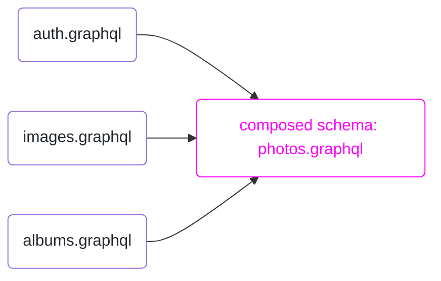

# Join

<h2>for defining *supergraphs* which join multiple *subgraphs*</h2>

```raw html
<table class=spec-data>
  <tr><td>Status</td><td>Draft</td>
  <tr><td>Version</td><td>0.2</td>
</table>
<link rel=stylesheet href=https://specs.apollo.dev/apollo-light.css>
<script type=module async defer src=https://specs.apollo.dev/inject-logo.js></script>
```



This document defines a [core schema](https://specs.apollo.dev/core/v0.1) named `join` for describing [core schemas](https://specs.apollo.dev/core/v0.1) which **join** multiple **subgraph** schemas into a single **supergraph** schema.

This specification provides machinery to:
- define [subgraphs](#def-subgraph) with the {join__Graph} enum and the {@join__graph} directive
- assign fields to subgraphs with the {@join__field} directive
- declare additional data required and provided by subgraph field resolvers with the `requires` and `provides` arguments to {@join__field}
- assign [keys and ownership](#sec-Owned-fields-on-owned-types) to types with the {@join__type} and {@join__owner} directives

# How to read this document

This document uses [RFC 2119](https://www.ietf.org/rfc/rfc2119.txt) guidance regarding normative terms: MUST / MUST NOT / REQUIRED / SHALL / SHALL NOT / SHOULD / SHOULD NOT / RECOMMENDED / MAY / OPTIONAL.

## What this document isn't

This document specifies only the structure and semantics of supergraphs. It's expected that a supergraph will generally be the output of a compilation process which composes subgraphs. The mechanics of that process are not specified normatively here. Conforming implementations may choose any approach they like, so long as the result conforms to the requirements of this document.

# Example: Photo Library

*This section is non-normative.*

We'll refer to this example of a photo library throughout the document:

:::[example](./photos.graphql) -- Photos library composed schema

The meaning of the `@join__*` directives is explored in the [Directives](#sec-Directives) section.

The example represents **one way** to compose three input schemas, based on [federated composition](https://www.apollographql.com/docs/federation/federation-spec/). These schemas are provided for purposes of illustration only. This spec places no normative requirements on composer input. It does not require that subgraphs use federated composition directives, and it does not place any requirements on *how* the composer builds a supergraph, except to say that the resulting schema must be a valid supergraph document.

The [auth](./auth.graphql) subgraph provides the `User` type and `Query.me`.

:::[example](auth.graphql) -- Auth schema

The [images](./images.graphql) subgraph provides the `Image` type and `URL` scalar.

:::[example](./images.graphql) -- Images schema

The [albums](./albums.graphql) subgraph provides the `Album` type and extends `User` and `Image` with album information.

:::[example](./albums.graphql) -- Albums schema


# Actors

```mermaid diagram -- Actors and roles within an example composition pipeline
flowchart TB
    classDef bg fill:#EBE6FF;
    subgraph A [subgraph A]
      schemaA([schema A]):::bg
      style schemaA color:#000
      endpointA([endpoint A]):::bg
      style endpointA color:#000
    end
    style A fill:#FCFDFF,stroke:#CAD0D8,color:#777F8E;
    subgraph B [subgraph B]
      schemaB([schema B]):::bg
      style schemaB color:#000
      endpointB([endpoint B]):::bg
      style endpointB color:#000
    end
    style B fill:#FCFDFF,stroke:#CAD0D8,color:#777F8E;
    subgraph C [subgraph C]
      schemaC([schema C]):::bg
      style schemaC color:#000
      endpointC([endpoint C]):::bg
      style endpointC color:#000
    end
    style C fill:#FCFDFF,stroke:#CAD0D8,color:#777F8E;
    subgraph producer["Producer ⠀⠀⠀⠀⠀⠀⠀⠀⠀⠀⠀⠀⠀⠀⠀⠀⠀⠀⠀⠀⠀⠀⠀⠀⠀⠀⠀⠀⠀⠀⠀⠀⠀⠀"]
      Composer
      style Composer color:#000
    end
    style producer fill:#FCFDFF,stroke:#CAD0D8,color:#777F8E;
    supergraph([Supergraph]):::bg
    style supergraph color:#000
    subgraph consumer["Consumer ⠀⠀⠀⠀⠀⠀⠀⠀⠀⠀⠀"]
      Router
      style Router color:#000
    end
    style consumer fill:#FCFDFF,stroke:#CAD0D8,color:#777F8E;
    A-->Composer:::bg
    B-->Composer:::bg
    C-->Composer:::bg
    Composer-->supergraphSchema([Supergraph Schema]):::bg
    style supergraphSchema color:#000
    supergraphSchema-->Router:::bg
    Router-->published([Published Schema]):::bg
    style published color:#000
    published-->Clients:::bg
    style Clients color:#000
    Clients-->Router:::bg
```

<a name=def-producer>**Producers**</a> generate supergraphs. This spec places requirements on supergraph producers.

<a name=def-consumer>**Consumers**</a> consume supergraphs. This spec places requirements on supergraph consumers.

<a name=def-composer>**Composers** (or **compilers**)</a> are producers which compose subgraphs into a supergraph. This document places no particular requirements on the composition algorithm, except that it must produce a valid supergraph.

<a namme=def-router>**Routers**</a> are consumers which serve a composed schema as a GraphQL endpoint. *This definition is non-normative.*
  - Graph routers differ from standard GraphQL endpoints in that they are not expected to resolve fields or communicate with (non-GraphQL) backend services on their own. Instead, graph routers receive GraphQL requests and service them by performing additional GraphQL requests. This spec provides guidance for implementing routers, but does not require particular implementations of query separation or dispatch, nor does it attempt to normatively separate routers from other supergraph consumers.
  - Routers expose an [API schema](https://specs.apollo.dev/core/v0.1/#sec-Parts-of-a-Core-Schema) to clients that is created by transforming the supergraph schema (for example, the {join__Graph} enum and the directives described in this spec are removed from the API schema). The API schema is used to validate client operations and may be exposed to clients via introspection.

<a name=def-endpoint>**Endpoints**</a> are running servers which can resolve GraphQL queries against a schema. In this version of the spec, endpoints must be URLs, typically http/https URLs.

<a name=def-subgraph>**Subgraphs**</a> are GraphQL schemas which are composed to form a supergraph. Subgraph names and metadata are declared within the special {join__Graph} enum.

This spec does not place any requirements on subgraph schemas. Generally, they may be of any shape. In particular, subgraph schemas do not need to be supergraphs themselves or to follow this spec in any way; neither is it an error for them to do so. Composers MAY place additional requirements on subgraph schemas to aid in composition; composers SHOULD document any such requirements.

# Overview

*This section is non-normative.* It describes the motivation behind the directives defined by this specification.

A supergraph schema describes a GraphQL schema that can be served by a router. The router does not contain logic to resolve any of the schema's fields; instead, the supergraph schema contains directives starting with {@join__} that tell the router which subgraph endpoint can resolve each field, as well as other information needed in order to construct subgraph operations.

The directives described in this specification are designed for a particular query planning algorithm, and so there are some restrictions on how they can be combined that originate from the requirements of this algorithm. For example, this specification describes a concept of [type ownership](#sec-Owned-fields-on-owned-types) which exists not because we believe it describes the ideal method of structuring your subgraphs, but because this query planning algorithm depends on type ownership. We hope that future versions of this specification can relax some of these restrictions. 

Each supergraph schema contains a list of its included subgraphs. The [{join__Graph}](#join__Graph) enum represents this list with an enum value for each subgraph. Each enum value is annotated with a [{@join__graph}](#@join__graph) directive telling the router what endpoint can be used to reach the subgraph, and giving the subgraph a human-readable name that can be used for purposes such as query plan visualization and server logs.

To resolve a field, the router needs to know to which subgraphs it can delegate the field's resolution. One explicit way to indicate this in a supergraph schema is by annotating the field with a [{@join__field}](#@join__field) directive specifying which subgraph should be used to resolve that field. (There are other ways of indicating which subgraphs can resolve a field which will be described later.)

In order for the router to send an operation that resolves a given field on a parent object to a subgraph, the operation needs to first resolve the parent object itself. There are several ways to accomplish this, described below. The examples below include abbreviated versions of the supergraph schemas which do not include the `schema` definition, directive definitions, or the `join__Graph` definition. This specification does not require the subgraph operations to be the same as those described in these examples; this is just intended to broadly describe the meanings of the directives.

## Root fields

If a field appears at the root of the overall operation (query or mutation), then it can be placed at the root of the subgraph operation.

```graphql example -- Root fields
# Supergraph schema
type Query {
  fieldA: String @join__field(graph: A)
  fieldAlsoFromA: String @join__field(graph: A)
  fieldB: String @join__field(graph: B)
}

# Operation
{ fieldA fieldAlsoFromA fieldB }
# Generated subgraph operations
## On A:
{ fieldA fieldAlsoFromA }
## On B:
{ fieldB }
```


## Fields on the same subgraph as the parent operation

If a field's parent field will be resolved by an operation on the same subgraph, then it can be resolved as part of the same operation, by putting it in a nested selection set on the parent field's subgraph operation. Note that this example contains {@join__owner} and {@join__type} directives on an object type; these will be described later.

```graphql example -- Fields on the same subgraph as the parent operation
# Supergraph schema
type Query {
  fieldA: X @join__field(graph: A)
}

type X @join__owner(graph: A) @join__type(graph: A, key: "nestedFieldA") {
  nestedFieldA: String @join__field(graph: A)
}

# Operation
{ fieldA { nestedFieldA } }
# Generated subgraph operations
## On A:
{ fieldA { nestedFieldA }}
```

## Fields provided by the parent field

Sometimes, a subgraph {G} may be capable of resolving a field that is ordinarily resolved in a different subgraph if the field's parent object was resolved in {G}. Consider an example where the `Product.priceCents: Int!` field is usually resolved by the Products subgraph, which knows the `priceCents` for every `Product` in your system. In the Marketing subgraph, there is a `Query.todaysPromotion: Product!` field. While the Marketing subgraph cannot determine the `priceCents` of every product in your system, it does know the `priceCents` of the promoted products, and so the Marketing subgraph can resolve operations like `{ todaysPromotion { priceCents } }`.

When this is the case, you can include a `provides` argument in the `@join__field` listing these "pre-calculated" fields. The router can now resolve these fields in the "providing" subgraph instead of in the subgraph that would usually be used to resolve those fields.

```graphql example -- Provided fields
# Supergraph schema
type Query {
  todaysPromotion: Product! @join__field(graph: MARKETING, provides: "priceCents")
  randomProduct: Product! @join__field(graph: PRODUCTS)
}

type Product @join__owner(graph: PRODUCTS) @join__type(graph: PRODUCTS, key: "id") {
  id: ID! @join__field(graph: PRODUCTS)
  priceCents: Int! @join__field(graph: PRODUCTS)
}

# Operation showing that `priceCents` is typically resolved on PRODUCTS
{ randomProduct { priceCents } }
# Generated subgraph operations
## On PRODUCTS
{ randomProduct { priceCents } }

# Operation showing that `provides` allows `priceCents` to be resolved on MARKETING
{ todaysPromotion { priceCents } }
# Generated subgraph operations
## On MARKETING
{ todaysPromotion { priceCents } }
```

## Fields on value types

Some types have the property that all of their fields can be resolved by *any* subgraph that can resolve a field returning that type. These types are called *value types*. (Imagine a type `type T { x: Int, y: String }` where every resolver for a field of type `T` actually produces an object like `{x: 1, y: "z"}`, and the resolvers for the two fields on `T` just unpack the values already in the object.) In a supergraph schema, a type is a value type if it does not have a [{@join__owner}](#@join__owner) directive on it.

```graphql example -- Value types
# Supergraph schema
type Query {
  fieldA: X @join__field(graph: A)
  fieldB: X @join__field(graph: B)
}

type X {
  anywhere: String
}

# Operation
{ fieldA { anywhere } }
# Generated subgraph operations
## On A
{ fieldA { anywhere } }

# Operation
{ fieldB { anywhere } }
# Generated subgraph operations
## On B
{ fieldB { anywhere } }
```

## Owned fields on owned types

We've finally reached the most interesting case: a field that must be resolved by an operation on a different subgraph from the subgraph on which its parent field was resolved. In order to do this, we need a way to tell the subgraph to resolve that parent object. We do this by defining a special root field in the subgraph's schema: `Query._entities(representations: [_Any!]!): [_Entity]!`. This field takes a list of "representations" and returns a list of the same length of the corresponding objects resulting from looking up the representations in an application-dependent way.

What is a representation? A representation is expressed as the scalar type `_Any`, and can be any JSON object with a top-level `__typename` key with a string value. Often, a representation will be something like `{__typename: "User", id: "abcdef"}`: the type name plus one or more fields that you can use to look up the object in a database.

There are several ways that the router can calculate a representation to pass to a subgraph. In this specification, all non-value types have a specific subgraph referred to as its "owner", specified via a `@join__owner` directive on the type. Object types that are not value types are referred to as "entities"; the type `_Entity` referenced above is a union defined in each subgraph's schema consisting of the entity types defined by that subgraph. (Only subgraphs which define entities need to define the `Query._entities` field.) Entity types must also have at least one `@join__type` directive specifying the owning subgraph along with a {key}. For each additional subgraph which can resolve fields returning that type, there should be exactly one `@join__type` directive specifying that subgraph along with a {key}, which should be identical to one of the keys specified with the owning subgraph.

A key is a set of fields on the type (potentially including sub-selections and inline fragments), specified as a string. If a type `T` is annotated with `@join__type(subgraph: G, key: "a b { c }")`, then it must be possible to resolve the full field set provided as a key on subgraph G. Additionally, if you take an object with the structure returned by resolving that field set and add a field `__typename: "T"`, then you should be able to pass the resulting value as a representation to the `Query._entities` field on subgraph G.

In order to resolve a field on an entity on the subgraph that owns its parent type, where that subgraph is different from the subgraph that resolved its parent object, the router first resolves a key for that object on the previous subgraph, and then uses that representation on the owning subgraph.

For convenience, you may omit `@join__field(graph: A)` directives on fields whose parent type is owned by `A`.

```graphql example -- Owned fields on owned types
# Supergraph schema
type Query {
  fieldB: X @join__field(graph: B)
}

type X
  @join__owner(graph: A)
  # As the owner, A is allowed to have more than one key.
  @join__type(graph: A, key: "x")
  @join__type(graph: A, key: "y z")
  # As non-owners, B and C can only have one key each and
  # they must match a key from A.
  @join__type(graph: B, key: "x")
  @join__type(graph: C, key: "y z")
{
  # Because A owns X, we can omit @join__field(graph: A)
  # from these three fields.
  x: String
  y: String
  z: String
}

# Operation
{ fieldB { y } }
# Generated subgraph operations
## On B. `y` is not available, so we need to fetch B's key for X.
{ fieldB { x } }
## On A
## $r = [{__typename: "X", x: "some-x-value"}]
query ($r: [_Any!]!) { _entities(representations: $r]) { y } }
```

## Extension fields on owned types

The previous section described how to jump from one subgraph to another in order to resolve a field on the subgraph that owns the field's parent type. The situation is a bit more complicated when you want to resolve a field on a subgraph that doesn't own the field's parent type — what we call an extension field. That's because we no longer have the guarantee that the subgraph you're coming from and the subgraph you're going to share a key in common. In this case, we may need to pass through the owning type.

```graphql example -- Extension fields on owned types
# Supergraph schema
type Query {
  fieldB: X @join__field(graph: B)
}

type X
  @join__owner(graph: A)
  # As the owner, A is allowed to have more than one key.
  @join__type(graph: A, key: "x")
  @join__type(graph: A, key: "y z")
  # As non-owners, B and C can only have one key each and
  # they must match a key from A.
  @join__type(graph: B, key: "x")
  @join__type(graph: C, key: "y z")
{
  x: String
  y: String
  z: String
  c: String @join__field(graph: C)
}

# Operation
{ fieldB { c } }
# Generated subgraph operations
## On B. `c` is not available on B, so we need to eventually get over to C.
## In order to do that, we need `y` and `z`... which aren't available on B
## either! So we need to take two steps. First we use B's key.
{ fieldB { x } }
## On A. We use B's key to resolve our `X`, and we extract C's key.
## $r = [{__typename: "X", x: "some-x-value"}]
query ($r: [_Any!]!) { _entities(representations: $r]) { y z } }
## On C. We can finally look up the field we need.
## $r = [{__typename: "X", y: "some-y-value", z: "some-z-value"}]
query ($r: [_Any!]!) { _entities(representations: $r]) { c } }
```

We only need to do this two-jump process because the fields needed for C's key are not available in B; otherwise a single jump would have worked, like in the owned-field case.

Sometimes a particular extension field needs its parent object's representation to contain more information than its parent type's key requests. In this case, you can include a `requires` argument in the field's `@join__field` listing those required fields (potentially including sub-selections). **All required fields must be resolvable in the owning subgraph** (this restriction is why `requires` is only allowed on extension fields).

```graphql example -- Required fields
# Supergraph schema
type Query {
  fieldA: X @join__field(graph: A)
}

type X
  @join__owner(graph: A)
  @join__type(graph: A, key: "x")
  @join__type(graph: B, key: "x")
{
  x: String
  y: String
  z: String @join__field(graph: B, requires: "y")
}

# Operation
{ fieldA { z } }
# Generated subgraph operations
## On A. `x` is included because it is B's key for `X`; `y`
## is included because of the `requires`.
{ fieldA { x y } }
## On B..
## $r = [{__typename: "X", x: "some-x-value", y: "some-y-value"}]
query ($r: [_Any!]!) { _entities(representations: $r]) { z } }
```

# Basic Requirements

Schemas using the `join` core feature MUST be valid [core schema documents](https://specs.apollo.dev/core/v0.1) with {@core} directives referencing the `core` specification and this specification.

:::[example](photos.graphql#schema) -- {@core} directives for supergraphs

As described in the [core schema specification](https://specs.apollo.dev/core/v0.1/#sec-Prefixing), your schema may use a prefix other than `join` for all of the directive and enum names defined by this specification by including an `as` argument to the `@core` directive which references this specification. All references to directive and enum names in this specification MUST be interpreted as referring to names with the appropriate prefix chosen within your schema.

In order to use the directives described by this specification, GraphQL requires you to include their definitions in your schema.

Processors MUST validate that you have defined the directives with the same arguments, locations, and `repeatable` flag as given below.

:::[definition](join-v0.2.graphql)

Processors MUST validate that the schema contains an enum named {join__Graph}; see [its section below](#join__Graph) for other required properties of this enum.

As described in the core specification, all of the directives and enums defined by this schema should be removed from the supergraph's [API schema](https://specs.apollo.dev/core/v0.1/#sec-Parts-of-a-Core-Schema). For example, the {join__Graph} enum should not be visible via introspection.

# Enums

##! Graph

Enumerate subgraphs.

:::[definition](./join-v0.2.graphql#Graph)

Documents MUST define a {join__Graph} enum. Each enum value describes a subgraph. Each enum value MUST have a [{@join__graph}](#@join__graph) directive applied to it.

:::[example](photos.graphql#join__Graph) -- Using join__Graph to define subgraphs and their endpoints

The {join__Graph} enum is used as input to the [{@join__owner}](#@join__owner), [{@join__field}](#@join__field), and [{@join__type}](#@join__type) directives.

# Directives

##! @graph

:::[definition](./join-v0.2.graphql#@graph)

Declare subgraph metadata on {join__Graph} enum values. 

:::[example](photos.graphql#join__Graph) -- Using {@join__graph} to declare subgraph metadata on the {join__Graph} enum values.

The {@join__graph} directive MUST be applied to each enum value on {join__Graph}, and nowhere else. Each application of {@join__graph} MUST have a distinct value for the `name` argument; this name is an arbitrary non-empty string that can be used as a human-readable identifier which may be used for purposes such as query plan visualization and server logs. The `url` argument is an endpoint that can resolve GraphQL queries for the subgraph.

##! @type

:::[definition](./join-v0.2.graphql#@type)

Declares an entity key for a type on a subgraph.

When this directive is placed on a type `T`, it means that subgraph `graph` MUST be able to:
- Resolve selections on objects of the given type that contain the field set in `key`
- Use `Query._entities` to resolve representations of objects containing `__typename: "T"` and the fields from the field set in `key`

:::[example](photos.graphql#Image) -- Using {@join__type} to specify subgraph keys

Every type with a {@join__type} MUST also have a [{@join__owner}](#@join__owner) directive. Any type with a [{@join__owner}](#@join__owner) directive MUST have at least one {@join__type} directive with the same `graph` as the [{@join__owner}](#@join__owner) directive (the "owning graph"), and MUST have at most one {@join__type} directive for each `graph` value other than the owning graph. Any value that appears as a `key` in a {@join__type} directive with a `graph` value other than the owning graph must also appear as a `key` in a {@join__type} directive with `graph` equal to the owning graph.

##! @field

:::[definition](./join-v0.2.graphql#@field)

Specify the graph that can resolve the field.

The field's parent type MUST be annotated with a {@join__type} with the same value of `graph` as this directive, unless the parent type is a [root operation type](http://spec.graphql.org/draft/#sec-Root-Operation-Types).

If a field is not annotated with {@join__field} (or if the `graph` argument is not provided or `null`) and its parent type is annotated with `@join__owner(graph: G)`, then a processor MUST treat the field as if it is annotated with `@join__field(graph: G)`. If a field is not annotated with {@join__field} (or if the `graph` argument is not provided or `null`) and its parent type is not annotated with {@join__owner} (ie, the parent type is a value type) then it MUST be resolvable in any subgraph that can resolve values of its parent type.

:::[example](photos.graphql#User...Image) -- Using {@join__field} to join fields to subgraphs

Every field on a root operation type MUST be annotated with {@join__field}.

:::[example](photos.graphql#Query) -- {@join__field} on root fields

The `requires` argument MUST only be specified on fields whose parent type has a [{@join__owner}](#@join__owner) directive specifying a different `graph` than this {@join__field} directive does. All fields (including nested fields) mentioned in this field set must be resolvable in the parent type's owning subgraph. When constructing a representation for a parent object of this field, a router will include the fields selected in this `requires` argument in addition to the appropriate `key` for the parent type.

The `provides` argument specifies fields that can be resolved in operations run on subgraph `graph` as a nested selection under this field, even if they ordinarily can only be resolved on other subgraphs.
